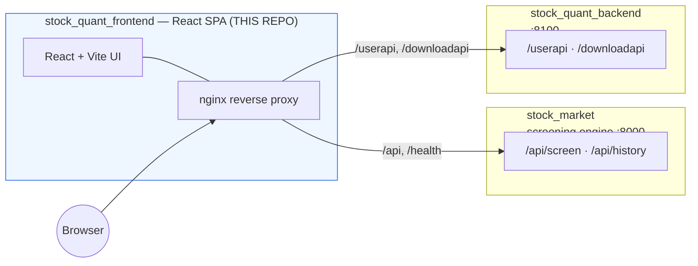

# Stock Quant — Web Frontend

> The React UI for the Taiwan-stock breakout screener. It shows the live screening results,
> lets you tune the screen parameters on the fly, opens a 6-month candlestick chart for any
> stock, and — once you sign in — saves your personal watchlist with target/cost prices.
> Available in **Traditional Chinese and English**.

**Tech:** React 18 · TypeScript · Vite · lightweight-charts · plain CSS · MSW · nginx · Docker

This is the **presentation layer** of a three-part system. Companion repositories: the
screening engine [`stock_market`](https://github.com/jummy1124/stock_quant) and the
user-data API `stock_quant_backend`.

> ⚠️ Screening and historical data are probabilistic reference information — **not investment advice.**

---

## Why it exists

The screening engine emits JSON; people need a screen they can actually read at a glance —
sortable, color-coded, auto-refreshing, with the chart one click away. This app is that
view. It's intentionally dependency-light (React + Vite + plain CSS, one charting library)
so the UI stays fast and the code stays easy to follow.

## Features

- **Live screening table** — polls `GET /api/screen` every 30s, sortable columns,
  red-up/green-down (Taiwan convention), graceful "data warming up" / stale / empty states.
- **Adjustable filter panel** — tune the gainer pool and breakout parameters (threshold,
  exclude locked limit-up, volume ratio, MA windows, slope look-back, full-day volume
  projection). Parameters are sent with each request for server-side re-computation,
  persisted to `localStorage`, with one-click "reset to defaults".
- **Click-to-chart** — any row opens a modal with ~6 months of candles + volume + MA5/20/60,
  rendered with [lightweight-charts](https://github.com/tradingview/lightweight-charts),
  fed by `GET /api/history/{symbol}`.
- **My Records** (after sign-in) — JWT auth against `/userapi`, per-user watchlist with
  target/cost price and live return estimates; optimistic updates with rollback.
- **Standalone download page** — export daily snapshots / your records as `.xlsx`.
- **Internationalization** — Traditional Chinese / English toggle, remembered across
  sessions, with no extra i18n dependency.

## System architecture

The frontend is **same-origin by design**: the browser only ever calls relative paths
(`/api`, `/userapi`, `/downloadapi`), and nginx (prod) or the Vite dev proxy (dev) forwards
them to the right backend. The backend IPs can change without rebuilding the UI, and there
is no CORS to manage.



## Getting started

### Prerequisites
- Node.js 18+ and npm

### Quickest path — UI only, no backends (MSW mock mode)

You can run the whole UI with the user-data API faked in the browser:

```bash
npm install
npx msw init public/ --save        # one-time: generate the mock service worker
echo "VITE_ENABLE_MSW=true" >> .env
npm run dev                         # http://localhost:5173
```

> Note: the live screening table still needs the screening engine; MSW only mocks the
> `/userapi` account + records layer so you can develop auth/records offline.

### Full local stack

```bash
npm install
cp .env.example .env
npm run dev                         # http://localhost:5173
```

Then start the two backends so the Vite dev proxy can reach them (same-origin, no CORS):

```bash
# screening engine (other repo) — exposes /api on :8000
python run_intraday.py --serve --api-port 8000

# user-data backend (other repo) — exposes /userapi on :8100
docker compose up            # or: poetry run uvicorn app.main:app --port 8100
```

The dev server proxies `/api` → `:8000` and `/userapi` / `/downloadapi` → `:8100`
(override targets with `BACKEND_URL` / `USERDATA_URL`).

### Docker (production-style, same-origin)

Multi-stage build (Node builds the assets → nginx serves them and reverse-proxies the APIs):

```bash
docker compose up -d --build        # then open http://localhost:5173
```

nginx proxies `/api` and `/health` to the screening engine (default
`host.docker.internal:8000`) and `/userapi` / `/downloadapi` to the user-data backend, so
the only port you must expose publicly is the frontend's.

## Environment variables

| Variable | Default | Purpose |
|---|---|---|
| `VITE_API_BASE_URL` | empty (same-origin) | leave empty to use the nginx/Vite `/api` proxy; set a full URL only to point the browser directly at a backend (then that backend needs CORS) |
| `BACKEND_URL` | `http://localhost:8000` | dev only: Vite proxy target for the screening engine |
| `USERDATA_URL` | `http://localhost:8100` | dev only: Vite proxy target for the user-data backend |
| `VITE_ENABLE_MSW` | unset | set `true` to mock `/userapi` in the browser during dev |

## Scripts

| Command | What it does |
|---|---|
| `npm run dev` | Start the dev server (`:5173`) |
| `npm run build` | Type-check (`tsc`) + bundle to `dist/` |
| `npm run preview` | Preview the production build |
| `npm run type-check` | `tsc --noEmit` only |

## Project structure

```
src/
  i18n/                 # zh-TW / en dictionaries + provider + useT() hook
  types/screen.ts       # backend contract types (Meta / BreakoutRow / ScreenSettings)
  api/                  # screen.ts, history.ts, userClient.ts (JWT + 401), authApi.ts
  hooks/useScreen.ts    # 30s polling, settings-aware, AbortController cleanup
  utils/format.ts       # number / percent / relative-time formatting + up/down classes
  auth/                 # AuthContext: token restore, auto-logout on 401
  records/              # RecordsRepo (InMemory/Http) + RecordsContext (optimistic updates)
  mocks/                # MSW handlers (only loaded when VITE_ENABLE_MSW=true)
  components/
    ScreenPage.tsx      # main page composition
    Header.tsx          # title + disclaimer
    StatusBar.tsx       # source badge / freshness / stats / warnings
    Controls.tsx        # row count + expandable filter panel + reset
    StockTable.tsx      # sortable results table
    StockDetailModal.tsx / StockChart.tsx   # candlestick + volume + MAs
    RecordsPage.tsx / StockRecordPanel.tsx  # My Records tab + per-stock editor
    LanguageSwitcher.tsx                     # zh-TW / EN toggle
    auth/               # LoginForm / RegisterForm / AuthPanel / UserMenu
    ui/Toast.tsx        # global toasts
  download/             # standalone /download.html page (snapshot + records .xlsx)
  App.tsx, main.tsx
```

## Notable engineering details

- **Same-origin architecture** eliminates CORS and decouples the UI from backend IPs.
- **Resilient polling:** `503` is treated as "data warming up" (keep last data, keep
  polling); fetch errors show a banner and self-heal on the next tick; `meta.warning` /
  `meta.last_error` are surfaced without dropping the current data.
- **Auth UX:** token persists in `localStorage`; any `401` triggers automatic logout.
- **Multi-page build:** the main SPA and the standalone download page are independent Vite
  entries, so the download page can later be split into its own project untouched.
- **i18n with zero dependencies:** a tiny typed dictionary + context, language remembered
  in `localStorage`.

---

*Disclaimer: this project is for technical and educational purposes. The information shown
is probabilistic and lagging, and is **not investment advice**.*
